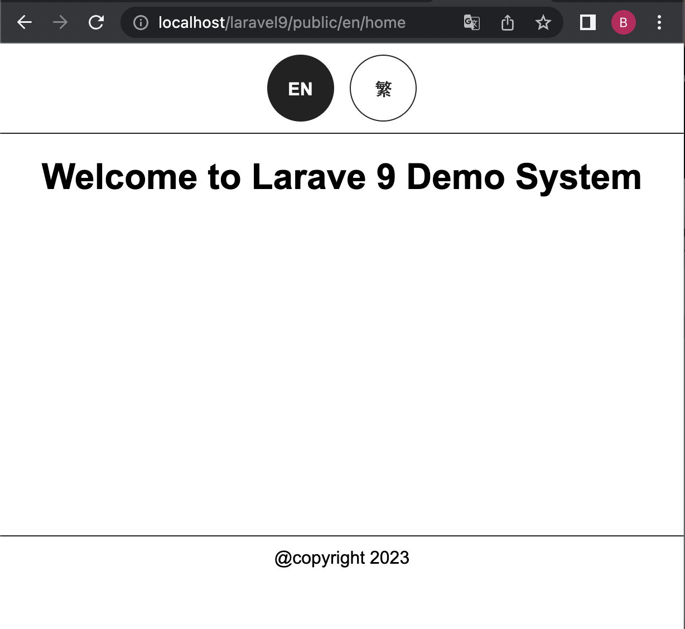
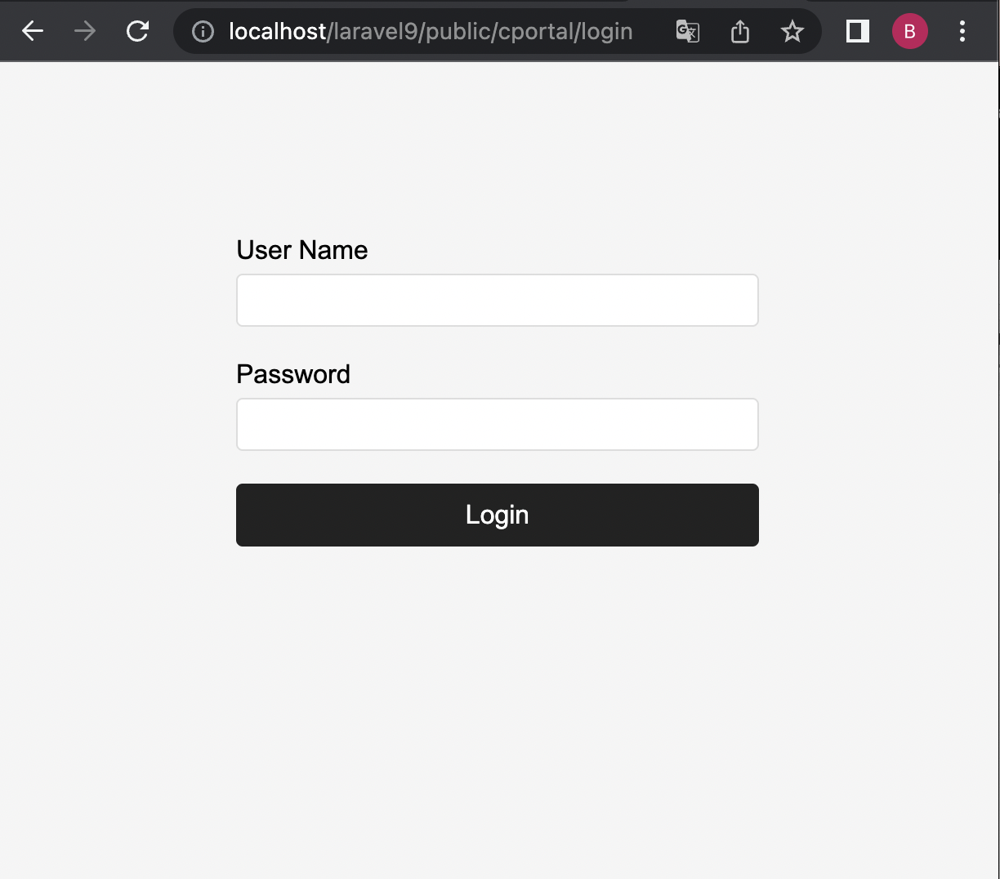

Url Format
---------------------------------------------------------------------------

cportal (backend):

http://{domain_name}/cportal/{class_name}/{function_name}/{parameter1}/{parameter2}/.../?t=xxx

website within multi language(frontend):

http://{domain_name}/{language_code}/{class_name}/{function_name}/{parameter1}/{parameter2}/.../?t=xxx

or

website within single language(frontend):

http://{domain_name}/{class_name}/{function_name}/{parameter1}/{parameter2}/.../?t=xxx

